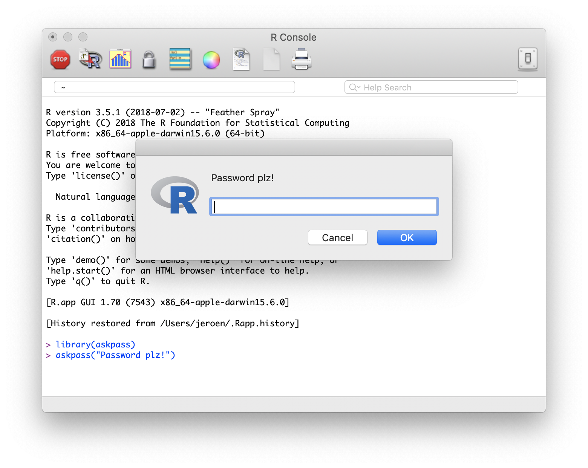
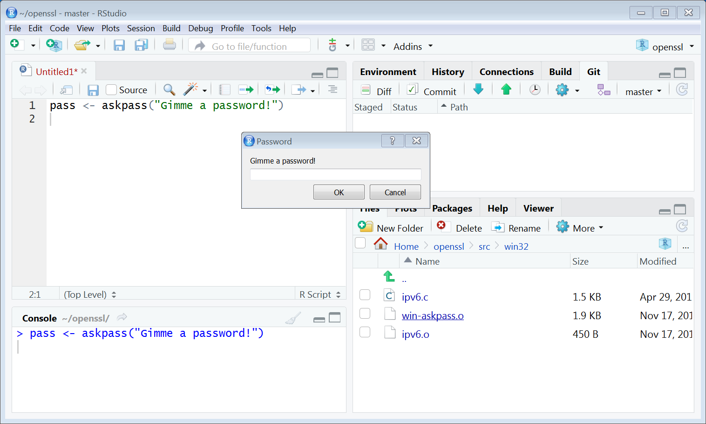
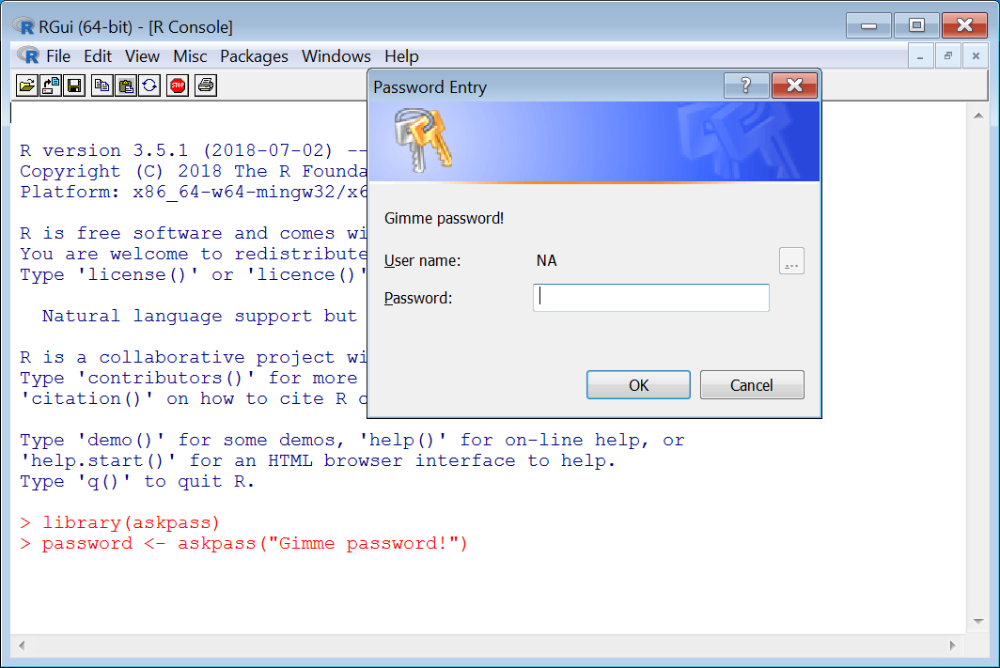
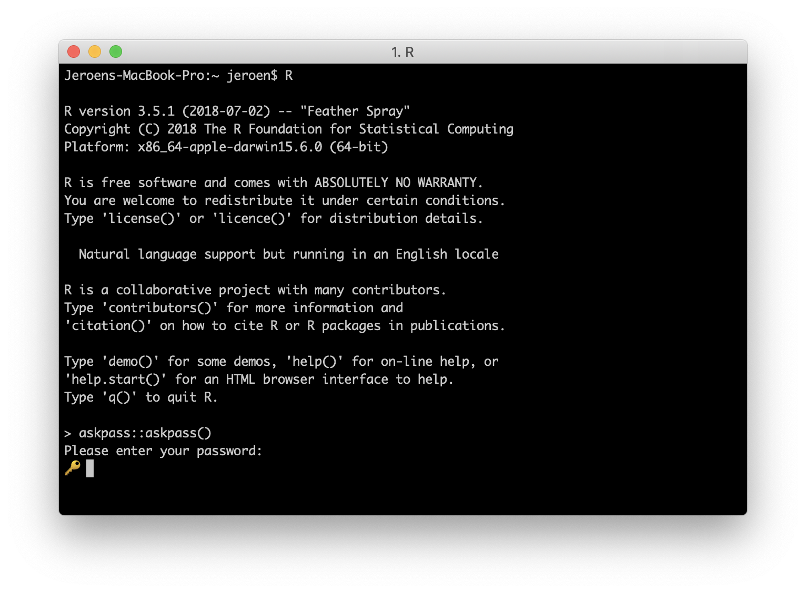

# askpass

> Password Entry Utilities for R, Git, and SSH

[](https://cran.r-project.org/package=askpass)
[](https://cran.r-project.org/package=askpass)

Cross-platform utilities for prompting the user for credentials or a 
passphrase, for example to authenticate with a server or read a protected key.
Includes native programs for MacOS and Windows, hence no 'tcltk' is required. 
Password entry can be invoked in two different ways: directly from R via the 
askpass() function, or indirectly as password-entry back-end for 'ssh-agent' 
or 'git-credential' via the SSH_ASKPASS and GIT_ASKPASS environment variables.
Thereby the user can be prompted for credentials or a passphrase if needed 
when R calls out to git or ssh.

## Called from R

To invoke the password prompt manually use:

```r
askpass::askpass()
```

This is used for example to read protected key files:

```r
library(openssl)
key <- rsa_keygen()
write_pem(key, 'testkey.pem', password = 'supersecret')
read_key('testkey.pem')
```

## Called from SSH / Git

The package also configures itself as the password entry back-end for ssh-agent and git-credential.
The easiest way to test this is using the credentials package:

```r
remotes::install_github("r-lib/credentials")
git_credential_ask('https://example.com')
```

## R for MacOS




## RStudio (server, desktop)





## RGUI / Windows




## Terminal


